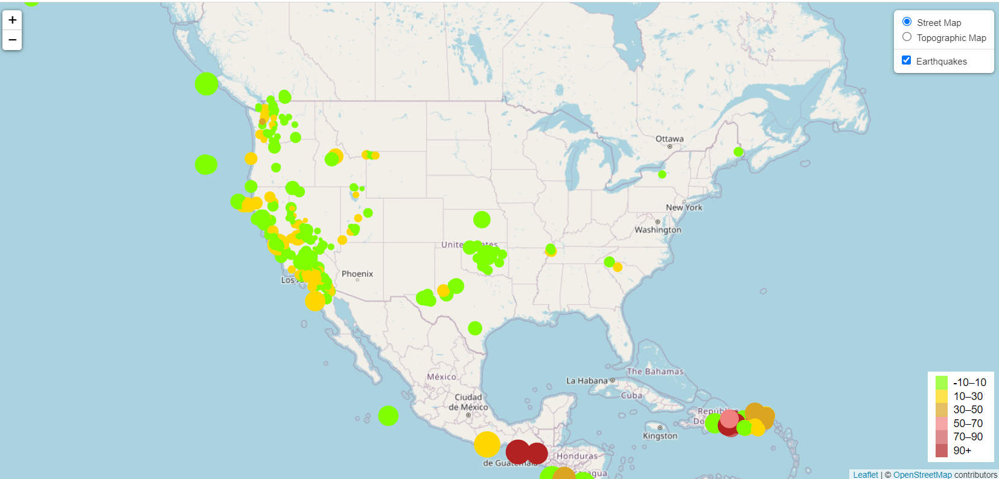

# leaflet-challenge
## Background
The United States Geological Survey, or USGS for short, is responsible for providing scientific data about natural hazards, the health of our ecosystems and environment, and the impacts of climate and land-use change. Their scientists develop new methods and tools to supply timely, relevant, and useful information about the Earth and its processes.

The USGS is interested in building a new set of tools that will allow them to visualize their earthquake data. They collect a massive amount of data from all over the world each day, but they lack a meaningful way of displaying it. I have been tasked with developing a way to visualize USGS data that will allow them to better educate the public and other government organizations (and hopefully secure more funding) on issues facing our planet.

## Steps
1. The USGS provides earthquake data in a number of different formats, updated every 5 minutes. Visit the <a href="https://earthquake.usgs.gov/earthquakes/feed/v1.0/geojson.php">USGS GeoJSON Feed </a> page and I chose a dataset to visualize. The following image is an example screenshot of what appears when I visit this link:

2. When I click a dataset (such as "All Earthquakes from the Past 7 Days"), I will get a JSON representation of that data. I used the URL of this JSON to pull in the data for the visualization.

3. Import and visualize the data by doing the following:

    * Using Leaflet, created a map that plots all the earthquakes from my dataset based on their longitude and latitude.

        * My data markers should reflect the magnitude of the earthquake by their size and the depth of the earthquake by color. Earthquakes with higher magnitudes should appear larger, and earthquakes with greater depth should appear darker in color.

        * The depth of the earth can be found as the third coordinate for each earthquake.
    * Included popups that provide additional information about the earthquake when its associated marker is clicked.

    * Created a legend that will provide context for my map data.
    * My visualization below:

    

    

